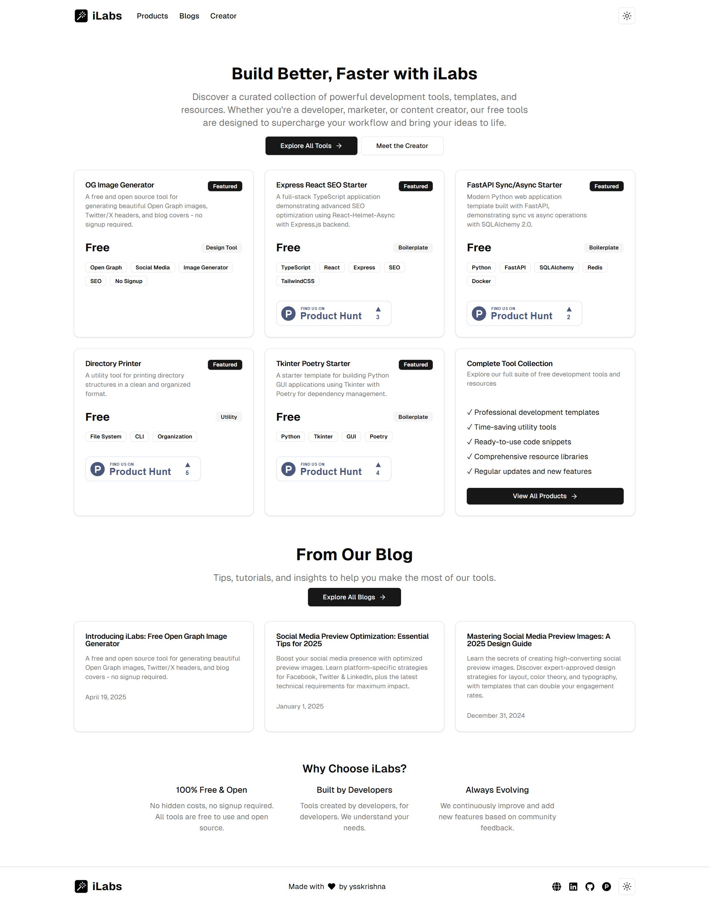
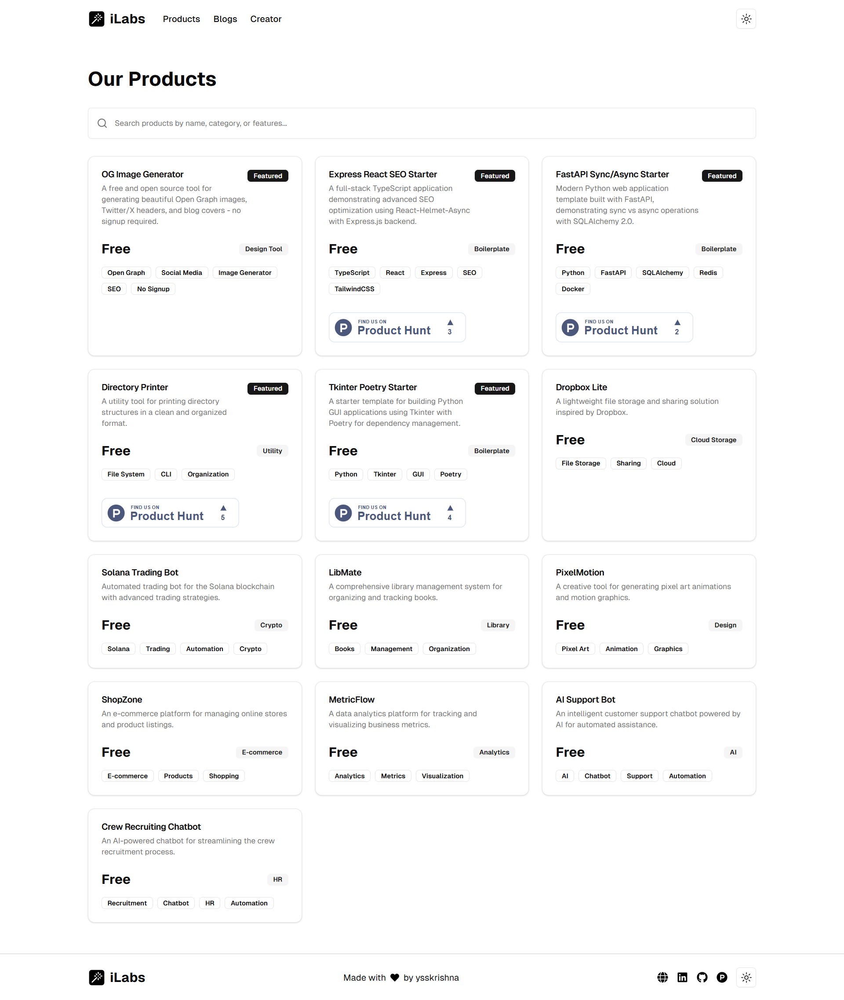
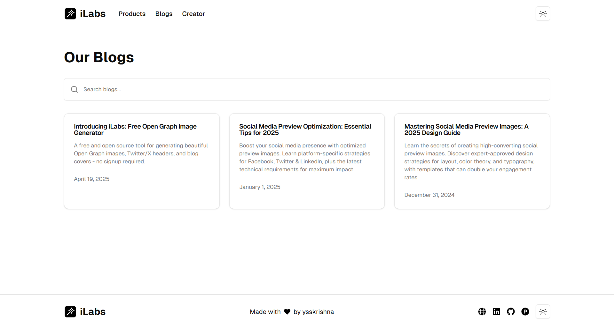
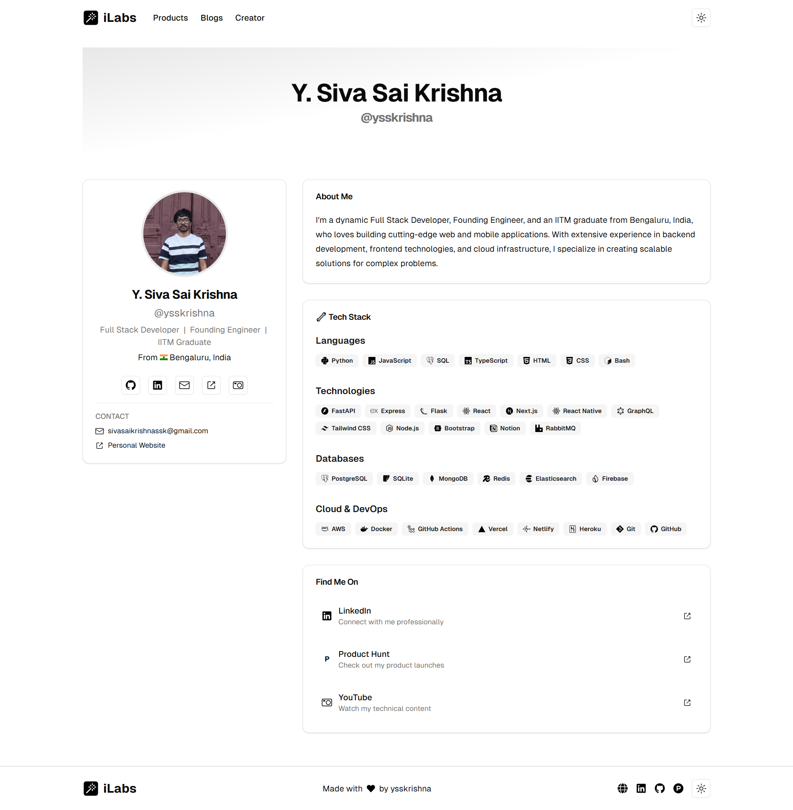

# iLabs

A collection of free developer tools and resources, including image generation tools, boilerplate templates, utility applications, and more - designed to help developers streamline their workflow and enhance their projects.

## 🌐 Live Demo

Visit [https://ilabs.vercel.app](https://ilabs.vercel.app) to try the tools online.

## Media

### Landing Page



### Products Page



### Blogs Page



### Creator Page



## 🚀 Getting Started

### Prerequisites

- Node.js 18+
- pnpm (recommended) or npm

### Installation

1. Clone the repository:

```bash
git clone https://github.com/ysskrishna/ilabs
cd ilabs
```

2. Install dependencies:

```bash
pnpm install
```

3. Set up environment variables in `.env.local`:

```bash
NEXT_PUBLIC_BASE_URL=http://localhost:3000
NEXT_PUBLIC_API_URL=http://localhost:3000/api
NEXT_PUBLIC_GOOGLE_ID=
NEXT_PUBLIC_GOOGLE_ADSENSE_ID=
```

4. Start the development server:

```bash
pnpm dev
```

Visit `http://localhost:3000` to access the application.

## 🛠️ Tech Stack

- [Next.js 15](https://nextjs.org/)
- [TypeScript](https://www.typescriptlang.org/)
- [Tailwind CSS](https://tailwindcss.com/)
- [Radix UI](https://www.radix-ui.com/)
- [Satori](https://github.com/vercel/satori)
- [Zod](https://zod.dev/)

## 🤝 Contributing

Contributions are welcome! Please feel free to submit a Pull Request. For major changes, please open an issue first to discuss what you would like to change.

1. Fork the repository
2. Create your feature branch (`git checkout -b feature/AmazingFeature`)
3. Commit your changes (`git commit -m 'Add some AmazingFeature'`)
4. Push to the branch (`git push origin feature/AmazingFeature`)
5. Open a Pull Request

## 📝 License

Copyright (c) 2025 Y. Siva Sai Krishna

This project is licensed under the GNU Affero General Public License v3.0 (AGPL-3.0) License - see the [LICENSE](LICENSE) file for details.

---

Built by [ysskrishna](https://github.com/ysskrishna)

This project is inspired by and built upon:

- [ogImage.click](https://github.com/weijunext/ogimage-click)
- [imgsrc-app](https://github.com/FadyMak/imgsrc-app)
